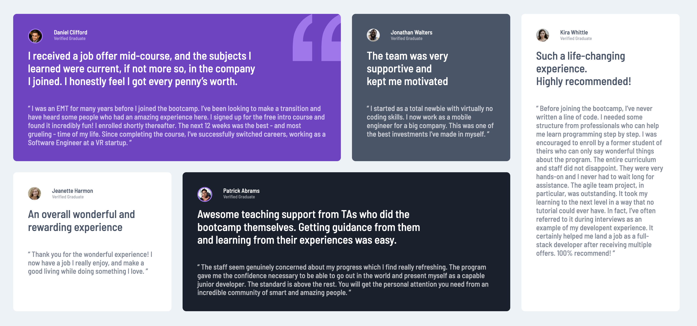

# Frontend Mentor - Product preview card component solution

This is a solution to the [Testimonials grid section](https://www.frontendmentor.io/learning-paths/building-responsive-layouts--z1qCXVqkD/steps/665075a813eea846b7032c6f/challenge/start). Frontend Mentor challenges help you improve your coding skills by building realistic projects.

## Table of contents

- [Overview](#overview)
  - [The challenge](#the-challenge)
  - [Screenshot](#screenshot)
  - [Links](#links)
- [My process](#my-process)
  - [Built with](#built-with)
  - [Self-Assessment](#Self-assessment)
    - [What I learnt](#What-I-learnt)
    - [What I am proud of](#What-I-am-proud-of)
    - [What I would do differently](#What-I-would-do-differently)
    - [Challenges](#Challenges)
    - [Help needed](#Help-needed)
    - [Continued development](#continued-development)

## Overview

### The challenge

Users should be able to:

- View the optimal layout depending on their device's screen size
- See hover and focus states for interactive elements

### Screenshot

### Links

- [Github Solution](https://github.com/RalphPastel972/testimonials-grid-section-main)
- [Live Site](https://ralphpastel972.github.io/testimonials-grid-section-main/)

## My process

### Built with

- Semantic HTML5 markup
- CSS custom properties
- Flexbox
- CSS Grid

### Self-assessment

#### What I learnt

I had to get deeper into grid to understand it better. I feel I still have so much to learn.

I used background-image for the very first time.

I also used var for fonts for the 1st time.

I am still really bad to estimate how long I need to do a challenge.

#### What I am proud of

Just my consistency.

#### What I would do differently

I would spend more time to plan the best layout and the best approach for a challenge.

#### Challenges

I am still way to slow.

#### Help needed

Nothing specific. But I am open to any critics that will make me improve.

#### Continued development

I will do again a challenge or two and then I will learn JS.
